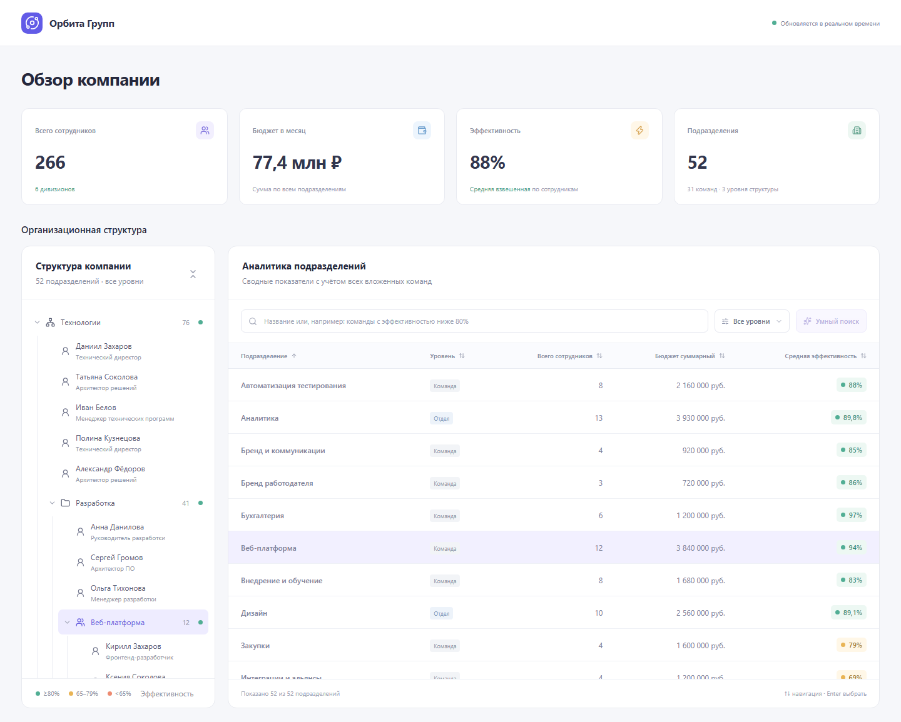

# Staff Pulse

Дашборд оргструктуры компании: дивизионы → отделы → команды. Интерактивное дерево, аналитическая таблица и live-обновления. Собственный Node.js mock API, 52 подразделения, React, Vite, TypeScript и styled-components. Без UI-библиотеки, авторизации и БД.



## Запуск одной командой

**Без нейронной модели:**

```sh
npm start
```

**С локальной нейронной моделью:**

```sh
npm run start:ai
```

**С локальной моделью на NVIDIA GPU:**

```sh
npm run start:ai:gpu
```

Все команды запускают production-сборку на **http://localhost:8080**. Нужен установленный Docker Desktop / Docker Engine с Compose; для коротких команд также нужен npm. Если локальный Docker Desktop на Windows или macOS ещё не запущен, npm-команда запускает его и ждёт готовности движка, затем поднимает приложение. Уже работающий Docker используется сразу. Для автозапуска нужна команда [`docker desktop start`](https://docs.docker.com/reference/cli/docker/desktop/start/) в установленной версии Docker Desktop. На Linux Docker Engine должен быть запущен заранее. Предварительно выполнять `npm install` или устанавливать Ollama не требуется: зависимости приложения и среда модели устанавливаются внутри контейнеров.

GPU-команда использует тот же автоматический установщик и кэш весов. Нужен Compose 2.30+. На Windows нужны NVIDIA GPU, актуальный драйвер и Docker Desktop с WSL2; на Linux — настроенный NVIDIA Container Toolkit. Режим GPU выбирается явно, поэтому обычный `start:ai` доступен и на компьютерах без видеокарты. [Требования Docker](https://docs.docker.com/desktop/features/gpu/), [настройка Ollama](https://docs.ollama.com/docker).

Режимы `start:ai` и `start:ai:gpu` автоматически запускают Ollama и подготавливают **Qwen 3.5 4B от Unsloth, квантизация Q8_0**. Исходный GGUF-файл занимает около **4,48 ГБ**. Поиск использует только текст, поэтому отдельный проектор изображений `mmproj` не скачивается. Образы контейнеров скачиваются отдельно. Генерация выполняется локально на CPU или NVIDIA GPU в зависимости от команды, API-ключ не нужен.

Приложение запускается, пока модель готовится в фоне: дерево, таблица, обычный поиск и live-обновления уже доступны. В кнопке **«Умный поиск»** вращается спиннер; подсказка при наведении или фокусе сообщает о скачивании или прогреве. После подготовки кнопка включается автоматически, перезагружать страницу не нужно. При ошибке подготовки или недоступности модели подсказка объясняет проблему, обычные функции приложения продолжают работать.

Подготовительный сервис скачивает GGUF напрямую из Hugging Face: фиксирует ревизию репозитория на время загрузки, проверяет размер, а Ollama сверяет SHA-256 файла. Затем сервис создаёт модель с её native-настройками и выполняет прогрев на синтетическом тексте с генерацией одного токена. Первый запуск требует интернета, подробный ход загрузки виден в терминале. Веса сохраняются в Docker volume; повторный запуск с теми же настройками использует кэш без обращения к Hugging Face. При временных сетевых ошибках выполняются до трёх попыток. Если подготовка завершилась ошибкой, повторите команду запуска. Полный первый запуск с загрузкой GGUF и повторный запуск из кэша проверены.

Без модели работают обычный поиск и детерминированный разбор поддержанных фраз. Этот режим не обращается к нейронным моделям, даже если в `.env` сохранён внешний API-ключ. Nginx отдаёт статику и проксирует API/SSE; данные автоматически меняются раз в 8 секунд.

Остановка любого режима с сохранением скачанных весов:

```sh
npm stop
```

Команды без Node.js/npm на компьютере (Docker должен быть уже запущен):

```sh
# Без модели
docker compose up --build --force-recreate --remove-orphans
# С моделью
docker compose -f docker-compose.yml -f docker-compose.ai.yml up --build --force-recreate --remove-orphans
# С моделью на NVIDIA GPU
docker compose -f docker-compose.yml -f docker-compose.ai.yml -f docker-compose.gpu.yml up --build --force-recreate --remove-orphans
# Остановить любой режим
docker compose -f docker-compose.yml -f docker-compose.ai.yml down --remove-orphans
```

Для переключения режима остановите текущий запуск и выполните другую команду. `--remove-orphans` убирает сервис модели при переходе на запуск без неё; volume с весами сохраняется.

Модель по умолчанию: [unsloth/Qwen3.5-4B-GGUF](https://huggingface.co/unsloth/Qwen3.5-4B-GGUF), `Q8_0`. После настройки она правильно разобрала **51/52** запросов на наборах разработки и **21/24** новых запросов; на RTX 5080 ответ обычно занимает около **0,9 секунды**. Режим **экспериментальный**: корректная схема JSON не гарантирует сохранение всех условий запроса. [Результаты сравнения моделей и ограничения](docs/search-model-evaluation.md) проверяются отдельно от тестов приложения. Для другой модели или квантизации измените `OLLAMA_MODEL` в `.env` и повторите выбранную команду запуска: веса будут подготовлены автоматически.

**Разработка, Node.js 24+ и npm:**

```sh
npm install && npm run dev
```

Откройте **http://localhost:5173**. Одна команда запускает Vite и API с перезагрузкой при изменении исходников. API отдельно доступен на http://localhost:3001/api/org-tree. Если используете Windows PowerShell 5, выполните две команды по очереди; в PowerShell 7 оператор `&&` поддерживается.

Файл `.env` необязателен: значения по умолчанию позволяют запустить всё сразу. Для настройки скопируйте `.env.example` в `.env`.

| Переменная         | По умолчанию                         | Назначение                                          |
| ------------------ | ------------------------------------ | --------------------------------------------------- |
| `WEB_PORT`         | `8080`                               | Порт Nginx в Docker                                 |
| `PORT`             | `3001`                               | Порт mock API; используется и Vite proxy            |
| `LIVE_INTERVAL_MS` | `8000`                               | Период изменений, от 1000 до 3600000 мс             |
| `OLLAMA_MODEL`     | `hf.co/unsloth/Qwen3.5-4B-GGUF:Q8_0` | Локальная модель и квантизация для обоих AI-режимов |
| `AI_TIMEOUT_MS`    | `30000` в режиме Ollama              | Тайм-аут запроса к модели, мс                       |
| `AI_API_KEY`       | пусто                                | Необязательный серверный ключ OpenAI                |
| `AI_MODEL`         | `gpt-4.1-mini`                       | Модель для естественно-языкового поиска             |

Ключ не передаётся в клиентскую сборку и не нужен для работы демо.

## Что реализовано

| Тег и коммит этапа    | Содержимое                                                                                                                                                                      |
| --------------------- | ------------------------------------------------------------------------------------------------------------------------------------------------------------------------------- |
| `step/1` — Foundation | Vite/React/TypeScript, абсолютные импорты, mock API, проверка схемы и структуры графа, кэш на 5 секунд, дерево с открытым вторым уровнем, загрузка/ошибка/пустой ответ          |
| `step/2` — Core       | Суммы по поддеревьям, взвешенная эффективность, таблица, сортировка всех столбцов, debounce 250 мс, связь выделения с деревом, переключение видов на небольшом экране           |
| `step/3` — Polish     | SSE-патчи без полного refetch, пересчёт только затронутых узлов и предков, подсветка 1,5 с, восстановление соединения с backoff, клавиатура, height transition и reduced motion |
| `step/4` — Bonus      | Docker, Nginx/gzip, проверяемый бюджет 200 KiB gzip, AI/локальный поиск с текстовым fallback, документация, скриншоты и CI                                                      |

История сдачи состоит из четырёх коммитов: по одному на этап, с тегами `step/1`–`step/4`. Стартовый scaffold включён в `step/1`.

Финальные правки интерфейса по замечаниям автора, актуальная документация и скриншоты объединены в `step/4`.

## Как пользоваться

- При ширине от 1280 px дерево и таблица видны одновременно; ниже — переключатель «Дерево / Таблица».
- Стрелка слева от подразделения раскрывает ветвь, включая команды. Дерево и таблица показывают **общую численность узла и всех потомков**. Внутри ветви сначала перечислены сотрудники, закреплённые непосредственно за этим подразделением, затем вложенные подразделения; у команды — её состав. Имена и должности вымышлены.
- Клик по заголовку сортирует по возрастанию, двойной — по убыванию. Поиск по названию применяется через 250 мс; фильтр уровня можно сочетать с поиском.
- Клик по строке или Enter выделяет узел в дереве и раскрывает путь к нему. Стрелки перемещают фокус по строкам, Home/End — в начало/конец.
- Значения в дереве, таблице и общих карточках обновляются автоматически; изменённые ячейки подсвечиваются. При изменении численности список сотрудников приходит в том же пакете. Раскрытые ветви сохраняются. При обрыве остаются последние данные и меняется индикатор соединения.
- Повторная загрузка использует условный запрос с ETag. Ответ 304 и одинаковый ответ 200 сохраняют рассчитанные объекты. Обычные live-патчи не загружают всё дерево повторно.

### Естественно-языковой поиск

Введите фразу в строку поиска и нажмите **«Умный поиск»** или **Enter**. Примеры:

- `Команды с эффективностью ниже 80%`
- `Отделы с бюджетом больше 5 млн`
- `Больше 10 сотрудников`
- `Команды с бюджетом меньше 3 млн и эффективностью не ниже 80%`
- `Выбери три отдела с самым большим бюджетом`
- `Команды с бюджетом от 700 тысяч до 2 млн рублей`
- `Отделы с численностью меньше 6 или бюджетом больше 4 млн`
- `Команды, у которых численность не равна 11`

Результат — проверенный структурированный фильтр, который применяется **на клиенте к агрегатам**. Источник указан под строкой:

- **AI-фильтр** — в режимах `start:ai` и `start:ai:gpu` фразу обрабатывает локальная нейронная модель через Ollama. Сервер запрашивает JSON по схеме и повторно проверяет ответ; под фильтром указано, что использована локальная модель.
- **Локальный разбор** — при запуске без модели: поддержанные русские фразы разбираются детерминированно. Этот режим не выдаётся за модель AI.
- **Текстовый поиск** — неизвестная фраза, сбой, тайм-аут или неподходящий ответ AI: исходный текст ищется в названиях.

Фильтр поддерживает сочетания через «и»/«или», диапазоны, «не равно», исключения по названию, сортировку и «топ N». Состав лучших N подразделений пересчитывается по актуальным метрикам; ручная сортировка столбца меняет порядок уже выбранных строк. Модель должна сохранять все условия и отклонять запросы о неизвестных свойствах или прошлых периодах. Проверка JSON подтверждает допустимость фильтра, но не правильность понимания фразы: модель может ошибаться в числах и отрицаниях. Интерфейс показывает применённые условия для проверки пользователем. При отказе модели, некорректном ответе или тайм-ауте исходная фраза целиком используется для текстового поиска. Запрос отправляется модели только по кнопке или Enter; дерево и метрики компании ей не передаются.

Интеграция OpenAI также доступна для разработки: задайте `SEARCH_PROVIDER=openai`, `AI_API_KEY` и при необходимости `AI_MODEL` в `.env`, затем запустите `npm run dev`. Реальный платный вызов OpenAI при разработке не выполнялся; контракт, ошибки и тайм-ауты проверены с подставным провайдером. Команды production-запуска выбирают режим явно: `npm start` — без модели, `npm run start:ai` — Ollama на CPU, `npm run start:ai:gpu` — Ollama с доступом к NVIDIA GPU.

## Проверки

```sh
npm run check
npm run format:check
npx playwright install chromium
npm run test:e2e
```

`check` запускает TypeScript, unit/integration-тесты, production-сборки клиента и сервера и проверку размера. Размер суммирует gzip всех JS/CSS/HTML/SVG в `dist`, включая чанки; при превышении 200 KiB сборка завершается ошибкой.

Тесты покрывают валидацию и циклы графа, агрегацию, случайные пакеты патчей против полного пересчёта, нулевую численность, неизменённые ссылки, API/ETag, SSE replay и разрывы истории, отмену запросов, гонки refetch/live, backoff и остановку соединения. Playwright проверяет загрузку/ошибку/пустое состояние, сортировку, фильтр, выделение, мобильный вид, клавиатуру, reduced motion, живой патч, offline/reconnect и восстановление устаревшего курсора. Для подготовки модели проверены этапы, ошибки, тайм-ауты, отмена и автоматическое включение кнопки. В Docker с настоящей GPU-моделью из кэша проверена работа интерфейса во время прогрева и последующий запрос без перезагрузки страницы; скачивание и его ошибки покрыты тестами с подставными ответами.

GitHub Actions повторяет проверки и отдельно поднимает Docker Compose. Итоговый интерфейс: [desktop](docs/screenshots/desktop.png), [mobile](docs/screenshots/mobile.png), [подготовка модели в фоне](docs/screenshots/model-preparation.png), [умный поиск с локальной моделью](docs/screenshots/smart-search.png).

Качество выбранной локальной модели проверяется отдельно на русских запросах с ожидаемыми условиями, сортировкой и лимитом. После `npm run start:ai` выполните:

```sh
npm run test:search-model
# Дополнительный набор
npm run test:search-model -- --fixture scripts/fixtures/search-holdout.json
# Новые формулировки, не использованные для настройки инструкции
npm run test:search-model -- --fixture scripts/fixtures/search-challenge.json
```

Проверка сравнивает все поля фильтра и источник ответа, включая сохранение исходной фразы для неподдерживаемых условий. Она печатает ошибки и время ответа и завершается ненулевым кодом при несовпадениях. Это отдельная проверка живой модели; обычные тесты и CI не скачивают её. Для JSON-отчёта добавьте `-- --output search-evaluation.json`.

Для обновления скриншотов запустите приложение через Docker Compose и выполните:

```sh
node scripts/capture-screenshots.mjs http://localhost:8080
```

Скрипт сохраняет desktop-вид с деревом и таблицей, а также мобильный вид дерева в `docs/screenshots/`.

## Архитектура и решения

- [Слои и поток данных](docs/architecture.md)
- [Модель, агрегация и точный контракт SSE-патча](docs/data-model.md)
- [ADR: SSE, кэш и восстановление](docs/adr/001-sse-and-recovery.md)
- [ADR: инкрементальная агрегация](docs/adr/002-incremental-aggregation.md)
- [ADR: AI и безопасный структурированный фильтр](docs/adr/003-ai-search.md)

Mock-сервер хранит состояние в памяти: перезапуск возвращает исходные данные и меняет идентификатор потока. Патчи меняют метрики и состав сотрудников, но не топологию подразделений. Сотрудники не считаются дополнительными подразделениями и не прибавляются к метрикам повторно. История ограничена 128 событиями; при её потере нужен один новый снимок. Таблица не виртуализирована: для демонстрационных 52 узлов это намеренное упрощение.

## AI в разработке

Использован **OpenAI Codex**. С его помощью созданы scaffold, mock API, доменная модель, компоненты styled-components, поиск, тесты, Docker и документация. Независимые агенты работали над сервером, доменной моделью и инфраструктурой; основной агент интегрировал изменения и проверял реальные diff и поведение в браузере.

**Что переписано после первоначальной генерации и почему:**

1. Начальный seed ошибочно содержал суммы у родителей. Родительские значения заменены собственными метриками, чтобы клиент не считал сотрудников и бюджет повторно.
2. Первоначальное восстановление SSE зависело от промежуточного React render. Оно вынесено в отдельный контроллер с явным повторным подключением и очисткой ресурсов.
3. Добавлено сравнение курсоров снимков: запоздавшие 200/304 не могут откатить уже полученный live-патч. Сценарии воспроизведены отдельными тестами.
4. Локальный поиск ограничен полностью распознанными фразами; неподдержанные условия приводят к текстовому fallback. Добавлены тесты отрицаний, неизвестных условий и невалидных ответов провайдера.
5. Проверки дополнены реальным браузером и контейнерами: компиляция сама по себе не подтверждает восстановление соединения, адаптивность или Nginx proxy.

**Ручные правки:**

- Поудалял лишнее(всякий декоративный мусор без функционала). Потому что руками быстрее.
- Поправил UI, стили, верстку. Руками быстрее и проще. ИИ часто косячит в этом.
