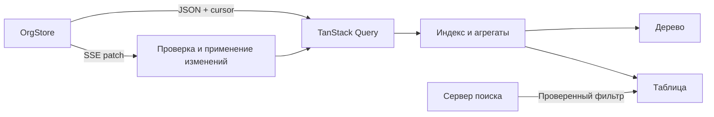

# Архитектура Staff Pulse

Staff Pulse — приложение для просмотра структуры компании и аналитики подразделений. React-клиент получает исходный список узлов, строит индекс и рассчитывает показатели поддеревьев. Node.js-сервер хранит демонстрационные данные в памяти и передаёт изменения метрик через SSE.

## Слои и ответственность

| Слой           | Файлы                                                                                  | Ответственность                                                                   |
| -------------- | -------------------------------------------------------------------------------------- | --------------------------------------------------------------------------------- |
| Сервер данных  | `server/data.ts`, `server/org-store.ts`                                                | Исходные показатели, атомарные ревизии, журнал последних изменений                |
| HTTP и SSE     | `server/app.ts`, `server/sse.ts`                                                       | Снимок, условный GET, восстановление потока, очередь медленного клиента           |
| Домен          | `src/domain/`                                                                          | Проверка JSON и графа, индекс, агрегаты, применение пакетов изменений             |
| Данные клиента | `src/data/`                                                                            | TanStack Query, согласование снимка с live-кэшем, управление соединением          |
| Представление  | `src/ui/`, `src/App.tsx`                                                               | Дерево, таблица, выбор узла, сортировка, состояния загрузки и соединения          |
| Поиск          | `server/search.ts`, `server/local-search.ts`, `server/search-schema.ts`, `src/search/` | Выбор провайдера, разбор фразы, схема фильтра и применение к актуальным агрегатам |

## Загрузка и обновление

1. `GET /api/org-tree` возвращает плоский массив и курсор в `X-Org-Cursor`. Клиент проверяет каждую запись, ссылки на родителей и отсутствие циклов. Ошибочный снимок не публикуется частично.
2. Индекс и первоначальные агрегаты строятся за `O(n)`. Их карты сохраняются в одном снимке TanStack Query с ключом `['org-tree']`.
3. SSE подключается с курсором снимка. Сервер сначала воспроизводит пропущенные пакеты, затем сообщает `ready` и продолжает передавать изменения.
4. Пакет применяется только к ожидаемой ревизии. Обновляются исходные узлы и агрегаты затронутых поддеревьев; неизменённые объекты сохраняют ссылки. Обычный пакет не вызывает повторную загрузку всего дерева.
5. Разрыв истории или смена экземпляра сервера требуют нового снимка. Контроллер соединения закрывает старый поток, загружает данные и подключается от актуального курсора.

Фоновый HTTP-запрос может завершиться после более свежего SSE-пакета. При согласовании кэша более старый снимок той же серверной эпохи не откатывает уже применённые изменения. Ответ из прежней эпохи также не заменяет уже принятый снимок нового экземпляра. Отмена запроса последним наблюдателем TanStack Query использует `AbortSignal`. Остановка контроллера или переход офлайн отменяют начатое им HTTP-восстановление; присоединённый общий запрос сохраняется. Контроллер также освобождает EventSource, таймеры и обработчики браузера, а проверка поколения соединения игнорирует поздние продолжения.

## Кэш и состояние интерфейса

TanStack Query объединяет одновременные запросы одного ключа. `staleTime` равен 5 секундам, срок хранения неактивного кэша — 5 минут; возврат фокуса окну не запускает запрос. Повторный GET передаёт `If-None-Match`, ответ `304` позволяет повторно использовать снимок. Это прикладной кэш: ответ API имеет `Cache-Control: no-store`.

Выбранный узел, раскрытые ветви, сортировка и поисковая строка принадлежат представлению и не перезаписываются серверным пакетом. Дерево показывает суммарную численность поддерева и собственную эффективность подразделения; аналитическая таблица и обзор — рассчитанные показатели поддеревьев. Каждая ветвь, включая команду, раскрывается до списка собственных сотрудников из API. Эти записи не участвуют в агрегации отдельно: их количество уже включено в `headcount` узла. Сервер отправляет новую численность и соответствующий список атомарно. Подсветка изменений привязана к полям и ревизии. На узком экране дерево и таблица переключаются вкладками; у таблицы есть горизонтальная прокрутка и клавиатурная навигация.

## Развёртывание и ограничения

В разработке Vite проксирует `/api` на Node.js. В Compose клиент собирается в статические файлы и обслуживается nginx; API работает отдельным сервисом без опубликованного наружу порта. Общая внутренняя сеть обслуживает связь nginx с API; отдельная сеть API допускает исходящие запросы к необязательному AI-сервису. Для SSE у прокси отключены буферизация и gzip, увеличен таймаут чтения. Для статических ресурсов включён gzip; файлы с хешем имеют длительный кэш, HTML — повторную проверку.

`npm start` запускает базовый Compose с `SEARCH_PROVIDER=local`: умный поиск использует детерминированный парсер и текстовый fallback. `npm run start:ai` подключает `docker-compose.ai.yml` и выбирает `SEARCH_PROVIDER=ollama`. `npm run start:ai:gpu` дополнительно подключает `docker-compose.gpu.yml` и передаёт контейнеру Ollama доступ к NVIDIA GPU. Команды устанавливают зависимости в контейнерах; нужны Docker с Compose, а для коротких команд — npm. Ollama работает локально в отдельном контейнере без опубликованного порта. CPU-режим не требует видеокарты; GPU-режим требует поддержки NVIDIA со стороны хоста и Docker.

Перед каждой из трёх npm-команд автоматически выполняется `scripts/prepare-docker.mjs`: он проверяет доступность движка и API образов и при необходимости запускает установленный локальный Docker Desktop на Windows/macOS, затем ждёт его готовности. После успешной подготовки npm запускает Compose напрямую, сохраняя обычную работу терминала и дополнительные аргументы, например `-- --detach --wait`. На Linux или при выбранном удалённом движке недоступный Docker требует настройки со стороны пользователя. Сам Docker скрипт не устанавливает.

Модель по умолчанию — `hf.co/unsloth/Qwen3.5-4B-GGUF:Q8_0`. Исходный GGUF занимает около 4,48 ГБ; для текстового поиска отдельный проектор изображений не скачивается. Подготовительный сервис вызывает `scripts/prepare-model.mjs`, который загружает файл напрямую из Hugging Face, фиксируя ревизию для метаданных и самого файла. Он проверяет размер, а Ollama сверяет SHA-256 при приёме blob. Импорт задаёт native renderer и parser `qwen3.5`; для поддержанного семейства Gemma используются его собственные настройки. Временные сетевые ошибки получают до трёх попыток; ошибки метаданных и digest останавливают подготовку модели.

API и интерфейс запускаются независимо от подготовки модели. Долгоживущий сервис `scripts/serve-model.mjs` открывает внутренний HTTP-маршрут `/status` и готовит модель в фоне. Он сообщает этапы `preparing`, `downloading`, `warming`, а `ready` выдаёт только после прогрева на синтетическом тексте с генерацией одного токена. При ошибке подготовки сервис сохраняет доступность и сообщает `error`; его healthcheck проверяет HTTP, поэтому ожидание Compose не блокируется скачиванием весов.

`GET /api/search/status` проксирует состояние через `server/search-status.ts`: проверяет схему и соответствие `OLLAMA_MODEL`, ограничивает запрос одной секундой и возвращает `unavailable` при недоступном сервисе. В режимах `local` и `openai` ответ сразу `ready`; при прямом запуске Ollama без `MODEL_STATUS_URL` проверяется наличие модели через `/api/show`. Клиент опрашивает статус раз в две секунды до готовности и раз в 15 секунд после неё. Спиннер и подсказка блокируют только кнопку умного поиска; дерево, таблица, поиск по названию и SSE продолжают работать. После подготовки кнопка становится доступной без перезагрузки страницы. Ошибка и недоступность отображаются отдельной подсказкой с последующей проверкой восстановления.

Веса хранятся в volume, а не в репозитории или образе клиента. При повторном запуске сервис проверяет native-настройки кэша и использует его без обращения к Hugging Face; несоответствие требует переимпорта. Полные загрузки Qwen и Gemma, прогрев Qwen Q8 на GPU и повторные запуски из кэша проверены. Для смены модели используется `OLLAMA_MODEL`.

Оба нейронных провайдера возвращают один и тот же проверяемый фильтр. К нему применяются общие ограничения схемы, тайм-аут и отмена; результаты фильтруются на клиенте по текущим агрегатам. При сбое Ollama запрос не отправляется внешнему провайдеру. `npm stop` останавливает приложение и модель, сохраняя скачанные веса.

Фильтр состоит из OR-групп, внутри которых условия соединены через AND, а также сортировки и лимита. Повторные сравнения одной метрики выражают диапазон. Таблица применяет условия и ручной выбор уровня, затем сортирует по запросу и выбирает первые N строк. При SSE-патче этот отбор вычисляется заново. Ручная сортировка столбца действует на порядок выбранных строк и не меняет критерий отбора «топ N».

Локальная модель экспериментальна. Проверка схемы не обнаруживает все смысловые ошибки: модель может потерять условие, перепутать оператор или число. [Результаты проверки моделей](search-model-evaluation.md) на основном и дополнительном наборах дополняют тесты сетевого контракта и инфраструктуры. Исторические результаты прежней схемы из пяти полей не считаются результатами расширенного контракта.

`scripts/check-size.mjs` суммирует gzip-размер каждого HTML/CSS/JS/SVG-файла из `dist` при уровне сжатия 6. Порог — `200 × 1024` байт; превышение завершает проверку ошибкой. Это ограничение клиентских ресурсов, а не размера Docker-образа. Клиентский Dockerfile запускает этот контроль при сборке.

Данные и журнал находятся в памяти одного процесса. Перезапуск восстанавливает демонстрационный набор и создаёт новую эпоху. Хранение в БД и согласование нескольких API-процессов в объём задания не входят. Команды запуска и фактические результаты проверок приведены в корневом README.

Подробности: [модель данных](data-model.md), [SSE и восстановление](adr/001-sse-and-recovery.md), [агрегация](adr/002-incremental-aggregation.md), [поиск](adr/003-ai-search.md).
